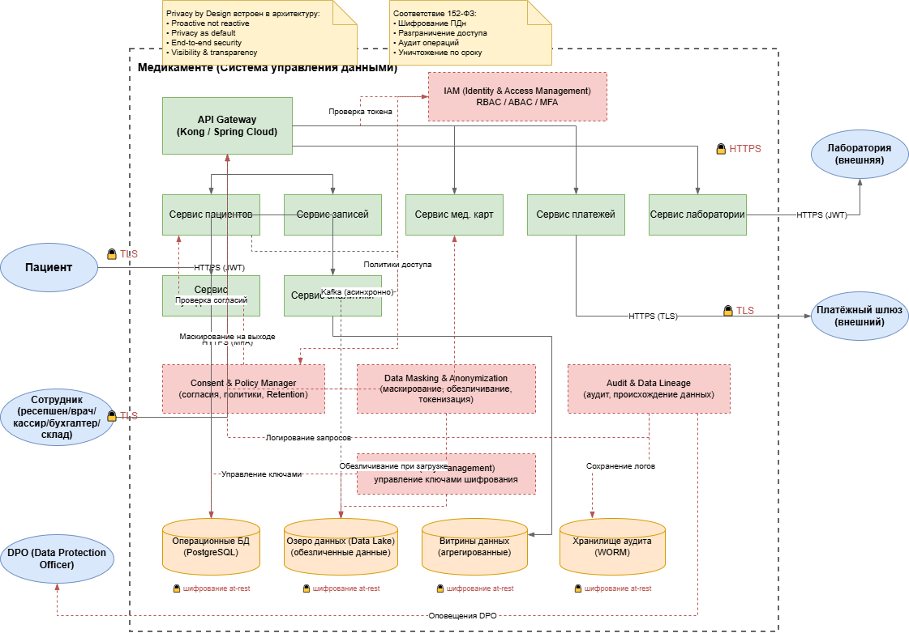

## Проектирование решения с учётом Privacy by Design

### 1. Принципы Privacy by Design в архитектуре

Согласно методологии Privacy by Design (PbD), защита конфиденциальности должна быть **встроена в архитектуру** на этапе проектирования, а не добавляться в конце. Ключевые принципы, которые мы закладываем в целевую архитектуру:

| Принцип PbD | Как реализован в архитектуре |
|-------------|------------------------------|
| **1. Проактивность, а не реактивность** | Все механизмы защиты (шифрование, маскирование, аудит) проектируются до написания кода |
| **2. Конфиденциальность по умолчанию** | Минимальный доступ, минимальный сбор данных — без дополнительных настроек |
| **3. Встроенность в дизайн** | Privacy-контроли входят в каждый микросервис, API-шлюз и слой данных |
| **4. Полная функциональность (positive-sum)** | Защита данных не снижает бизнес-ценность — аналитика работает на обезличенных данных |
| **5. Сквозная защита всего жизненного цикла** | Шифрование на всех этапах: сбор → передача → хранение → использование → удаление |
| **6. Прозрачность и видимость** | Полный аудит доступа, понятные пользователю политики обработки |
| **7. Уважение к приватности пользователя** | Пациент управляет своими данными (согласия, удаление, просмотр) |

---

### 2. Целевая архитектура C4 (уровень контекста и контейнеров)

На основе анализа As-Is и требований To-Be предлагаются **новые блоки** в архитектуру C4, которые обеспечивают соблюдение Privacy by Design.

#### 2.1. Диаграмма контекста C4 (Context) — целевое состояние

На уровне контекста добавляются следующие внешние системы и роли:

| Блок | Назначение | Связь с Privacy |
|------|------------|-----------------|
| **Платёжный шлюз (внешний)** | Обработка платежей через защищённый канал | Передаёт только токенизированные данные, без PII |
| **Госуслуги / ЕСИА** | Аутентификация пациентов | Снижает объём хранимых паспортных данных |
| **Лаборатория (внешняя)** | Передача результатов анализов через защищённый API | Минимизация данных, JWT-аутентификация |
| **Система оповещений (SMS/Email/Push)** | Уведомления пациентов | Передаёт только минимум идентификаторов |
| **DPO (Data Protection Officer)** | Внутренний пользователь — контроль соблюдения 152-ФЗ | Доступ к Audit Log и политикам |

---

### 3. Новые блоки в архитектуре (уровень контейнеров)

В целевую архитектуру добавляются **следующие контейнеры (сервисы/слои)**, обеспечивающие Privacy by Design:

#### 3.1. Слой управления согласиями и политиками (Consent & Policy Manager)

**Назначение:** Централизованное управление согласиями пациентов на обработку данных, политиками доступа и сроками хранения.

**Функции:**
- Хранение и версионирование согласий пациента (явное согласие, отзыв согласия)
- Применение политик доступа (ABAC) на основе тегов данных
- Управление сроками хранения (Retention Policies) — автоматическое удаление по истечении срока
- Интеграция с Data Lineage для применения политик ко всем потокам данных

**Соответствие PbD:**
- Privacy as default — без согласия данные не обрабатываются
- End-to-end security — политики применяются на всём жизненном цикле

#### 3.2. Слой маскирования и обезличивания (Data Masking & Anonymization Layer)

**Назначение:** Динамическое и статическое маскирование PII, обезличивание для аналитики.

**Функции:**
- **Динамическое маскирование** — на уровне API Gateway или БД: для роли «кассир» показывать только последние 4 цифры карты, для «врача» — полные медицинские данные, но без платёжной информации
- **Статическое обезличивание** — для озера данных и аналитики: замена ФИО на псевдонимы (хеши с солью), удаление прямых идентификаторов
- **Токенизация** — замена чувствительных данных (номер карты, СНИЛС) на токены с хранением в защищённом хранилище
- **K‑анонимизация** — для агрегированных отчётов, чтобы нельзя было идентифицировать конкретного пациента

**Соответствие PbD:**
- Privacy embedded into design — маскирование встроено в каждый API-контракт
- Full functionality — аналитика работает на обезличенных данных без потери бизнес-ценности

#### 3.3. Слой аудита и Data Lineage (Audit & Data Lineage Layer)

**Назначение:** Сквозной аудит всех операций с данными, отслеживание происхождения данных.

**Функции:**
- Запись всех действий: кто, когда, какие данные, какое действие (просмотр, изменение, удаление, передача)
- Хранение аудиторских логов в защищённом, неизменяемом хранилище (WORM — Write Once Read Many)
- Интеграция с SIEM для обнаружения аномалий (например, врач смотрит карту не своего пациента в нерабочее время)
- Data Lineage — визуализация путей движения данных от источника до потребителя
- Автоматическое уведомление DPO при нарушениях политик

**Соответствие PbD:**
- Visibility and transparency — все операции прозрачны и аудируемы
- End-to-end security — полный жизненный цикл отслеживается

#### 3.4. Слой управления ключами шифрования (Key Management Service — KMS)

**Назначение:** Централизованное управление криптографическими ключами для шифрования at‑rest и in‑transit.

**Функции:**
- Генерация, ротация и безопасное хранение ключей шифрования (AES-256)
- Интеграция с HashiCorp Vault / облачным KMS
- Разделение ключей по уровням конфиденциальности данных
- Аудит всех операций с ключами

**Соответствие PbD:**
- End-to-end security — ключи не хранятся вместе с данными
- Privacy embedded into design — шифрование встроено во все хранилища

#### 3.5. Слой управления идентификацией и доступом (Identity & Access Management — IAM)

**Назначение:** Централизованная аутентификация и авторизация с поддержкой RBAC и ABAC.

**Функции:**
- **Аутентификация:** MFA (для сотрудников), интеграция с ЕСИА (для пациентов), JWT/OAuth2
- **Авторизация:** RBAC (роли: пациент, ресепшен, врач, кассир, бухгалтер, склад, DPO, администратор) и ABAC (доступ на основе атрибутов: тегов данных, времени, локации)
- **Управление сессиями** и единый выход (SSO)
- **Проверка прав** на уровне API Gateway и каждого микросервиса

**Соответствие PbD:**
- Privacy as default — минимальный доступ по умолчанию
- Respect for user privacy — пациент управляет своим доступом к данным

---

### 4. Аналитический слой с учётом Privacy by Design

Отдельно проектируется **слой аналитической работы с данными**, который должен обеспечивать бизнес-потребности в BI, ML и AI без нарушения конфиденциальности.

#### 4.1. Архитектура аналитического слоя

| Компонент | Назначение | Privacy-механизмы |
|-----------|------------|-------------------|
| **Озеро данных (Data Lake)** | Хранение всех сырых данных | Данные хранятся в **обезличенном** виде (PII заменены на псевдонимы); шифрование at‑rest; строгое разграничение доступа |
| **Слой очистки и трансформации (ETL/ELT)** | Преобразование данных для аналитики | На этапе загрузки применяется **маскирование** и **агрегация**; PII не покидает защищённый контур |
| **Витрины данных (Data Marts)** | Агрегированные данные для BI-дашбордов | Только **агрегированные** данные без возможности деанонимизации; K‑анонимизация; доступ только через API с проверкой ролей |
| **ML-пайплайны** | Обучение моделей на исторических данных | Обучение на **обезличенных** данных; модели не хранят PII; применяется **дифференциальная приватность** при обучении |
| **BI-инструменты (Tableau / Power BI)** | Визуализация и дашборды | Доступ только к витринам; маскирование на уровне дашбордов; аудит всех запросов |
| **Privacy‑Preserving Analytics** | Выполнение аналитических запросов без раскрытия PII | Использование **гомоморфного шифрования** или **многопартийных вычислений** для чувствительных запросов (на перспективу) |

#### 4.2. Принципы работы аналитического слоя

1. **Data Minimisation** — в озеро данных попадают только данные, необходимые для аналитики. PII заменяются на псевдонимы ещё на этапе сбора.
2. **Purpose Limitation** — аналитические данные используются только для заранее определённых целей (отчётность, улучшение сервисов). Новые цели требуют пересогласования.
3. **Anonymization by Default** — все витрины данных содержат только обезличенную или агрегированную информацию. Прямые идентификаторы удалены.
4. **Audit Trail** — каждый запрос к аналитическим данным логируется с указанием пользователя, времени и объёма данных.
5. **Access Control** — доступ к аналитическим данным только через API с проверкой ролей. Аналитик не имеет прямого доступа к сырым данным.

---

### 5. Полная XML-диаграмма C4 (уровень контейнеров)

Ниже приведён полный XML-код для диаграммы контейнеров C4 целевой архитектуры с добавленными Privacy-блоками.

[Ссылка на исходный код UML](c4.xml)
---

### 6. Соответствие требованиям 152-ФЗ

Предложенная архитектура обеспечивает выполнение ключевых требований Федерального закона № 152-ФЗ «О персональных данных»:

| Требование 152-ФЗ | Реализация в архитектуре |
|-------------------|---------------------------|
| **Обеспечение конфиденциальности ПДн** | Шифрование at‑rest (AES-256) и in‑transit (TLS 1.3); управление ключами через KMS |
| **Разграничение доступа** | IAM с RBAC/ABAC; доступ только по принципу минимальной привилегии |
| **Регистрация и учёт действий** | Audit Layer с логированием всех операций; хранение в WORM-хранилище |
| **Оценка вреда** | Data Lineage для отслеживания всех потоков; возможность DPIA (Privacy Impact Assessment) |
| **Уничтожение по истечении срока** | Consent & Policy Manager с политиками Retention; автоматическое удаление |
| **Обработка только с согласия** | Consent Manager — хранение и проверка согласий пациентов |
| **Обезличивание для аналитики** | Data Masking & Anonymization Layer; в озере данных — только обезличенные данные |

---

### 7. Резюме

В целевую архитектуру C4 добавлены следующие **новые блоки**, обеспечивающие Privacy by Design:

1. **Consent & Policy Manager** — управление согласиями и политиками
2. **Data Masking & Anonymization Layer** — маскирование и обезличивание
3. **Audit & Data Lineage Layer** — аудит и происхождение данных
4. **KMS (Key Management Service)** — управление ключами шифрования
5. **IAM (Identity & Access Management)** — централизованное управление доступом

Аналитический слой построен на принципах **обезличивания по умолчанию**, **минимизации данных** и **строгого контроля доступа** через API, что позволяет использовать BI и ML без риска утечки PII.

